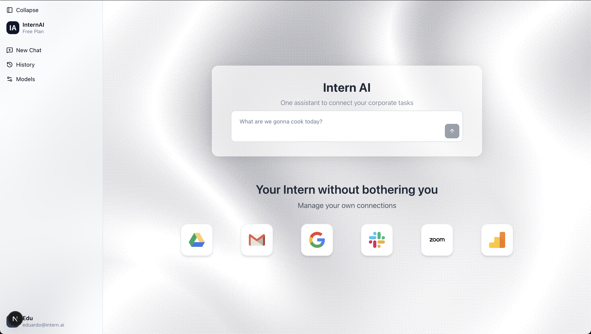
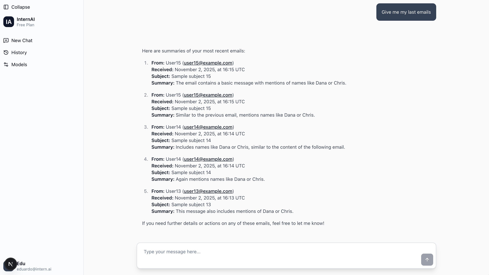
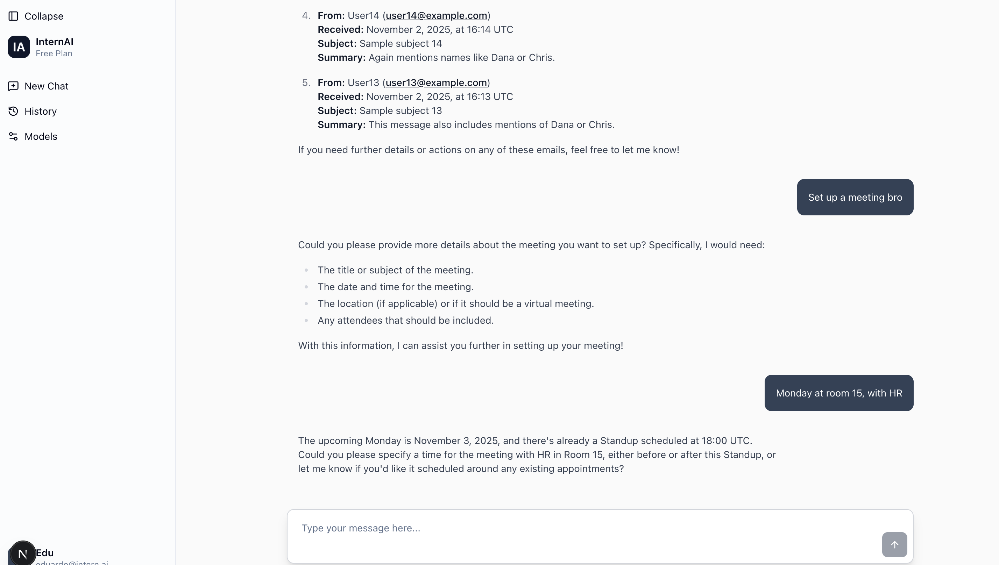

# Intern AI Agent

This is a RAG based assistant to connect your email and calendar application using Agno's framework.

## Quick demo

### Landing Page


### Chat Interface


### Schedule Management



## Quick Start

### Prerequisites
- Python 3.12+
- Node.js 18+
- OpenAI API key

### 1. Backend Setup

```bash
cd backend

# Create virtual environment
python3 -m venv .venv
source .venv/bin/activate  # Windows: .venv\Scripts\activate

# Install dependencies
pip install -r requirements.txt

# Configure environment
cp .env.example .env
# Add your OPENAI_API_KEY to .env

# Initialize database
sqlite3 agno.db < tools/test.sql
python tools/seed_db.py

# Start server
uvicorn main:app --reload --port 8000
```

**Backend runs at:** [http://localhost:8000](http://localhost:8000)

### 2. Frontend Setup

```bash
cd frontend

# Install dependencies
npm install

# Start dev server
npm run dev
```

**Frontend runs at:** [http://localhost:3000](http://localhost:3000)

## 3. Backend Setup - Docker Setup (Alternative)

```bash
# Backend
cd backend
cp .env.example .env  # Add your API keys
docker-compose up --build

# Initialize DB (first time)
docker-compose exec app sqlite3 agno.db < tools/test.sql
docker-compose exec app python tools/seed_db.py

```

## Architecture

### Backend (FastAPI + Agno)
- **RAGTeam**: Coordinates specialized agents
- **EmailAgent**: Query and search emails from SQLite
- **CalendarAgent**: Manage calendar events
- **SQLite**: Stores emails, calendar, chat history

**Main files:**
- `backend/agents/` - Agent definitions and tools
- `backend/routers/chat.py` - API endpoints
- `backend/tools/` - DB schema and seed data


## API Endpoints

| Endpoint | Method | Description |
|----------|--------|-------------|
| `/health` | GET | Health check |
| `/api/chat` | POST | Send message, get AI response |
| `/api/sessions/{id}/messages` | GET | Retrieve chat history |

## Environment Variables

### Backend `.env`
```env
OPENAI_API_KEY=sk-proj-your-key-here
FRONTEND_URL=http://localhost:3000
DATABASE_PATH=agno.db
```

### Frontend
No environment variables required (API URL is hardcoded for simplicity).

## Example Queries

- "Show me my recent emails"
- "Find emails from Dana"
- "What's on my calendar this week?"
- "Show me events with Chris"
- "Add a meeting tomorrow at 2pm with the team"

## Database Schema

**emails**
```sql
id, origin, sender, received_at, subject, content
```

**calendar**
```sql
id, title, start_ts, end_ts, attendees
```

Agno auto-creates tables for agent runs, messages, and tool calls.

## Tech Stack

**Backend:**
- FastAPI, Agno, OpenAI GPT-4o, SQLite, Docker

**Frontend:**
- Next.js 15, React 19, TypeScript, Tailwind CSS v4, shadcn/ui, react-markdown

## Project Structure

```
agent/
├── backend/
│   ├── agents/           # EmailAgent, CalendarAgent, RAGTeam
│   ├── routers/          # API endpoints
│   ├── tools/            # DB schema & seed script
│   ├── main.py           # FastAPI app
│   ├── requirements.txt
│   └── Dockerfile
└── frontend/
    ├── src/
    │   ├── app/          # Next.js pages
    │   ├── components/   # UI components
    │   └── lib/          # Utils & session management
    └── package.json
```

## Production Deployment

### Backend
```bash
docker build -t agent-backend .
docker run -d -p 8000:8000 \
  -e OPENAI_API_KEY=your-key \
  -v /data/agno.db:/app/agno.db \
  agent-backend
```

### Frontend
```bash
npm run build
npm start  # or deploy to Vercel
```
